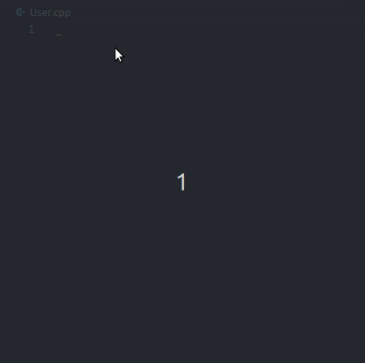
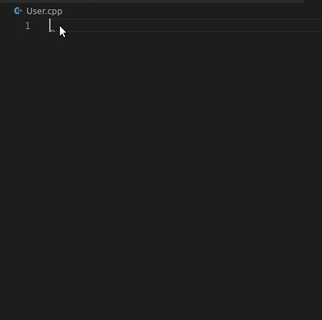
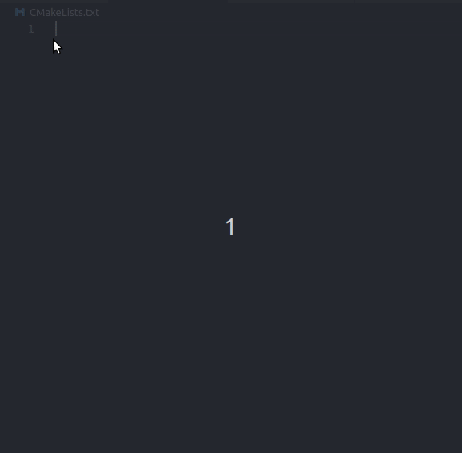
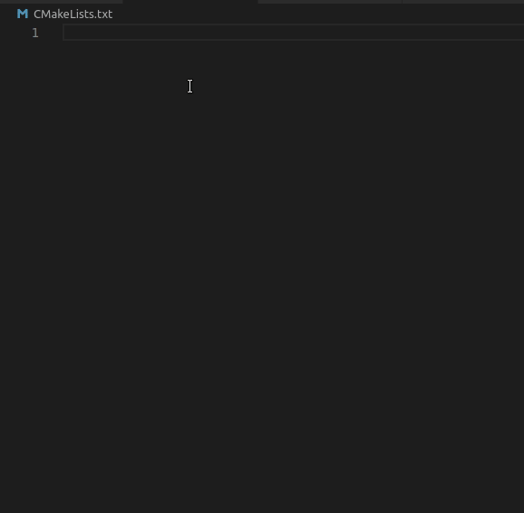

# EasyCpp

This is the VS Code snippets extension for easy creating hpp, cpp (with or without implemented pimpl idiom). Also this snippets could be used to crate basic CMakeLists files.

## Usage

### 1. Generate cpp class implementation with/without pimpl idiom

| _*cpp*_ | _*cpp-pimpl*_ |
|-----|-----------|
|  |  |

---  

### 2. Generate hpp class with/without pimpl idiom

 
| _*hpp*_ | _*hpp-pimpl*_ |
|-----|-----------|
|  |  |

---

### 3. Generate simple CMakeLists.txt with/without google tests

| _*cmake-project*_ | _*cmake-tests*_ |
|-----|-----------|
|  |  |

---

## Known Issues

None

## Repository

[Git repository](https://github.com/AlexandarDjordjevic/EasyCpp)

-----------------------------------------------------------------------------------------------------------
